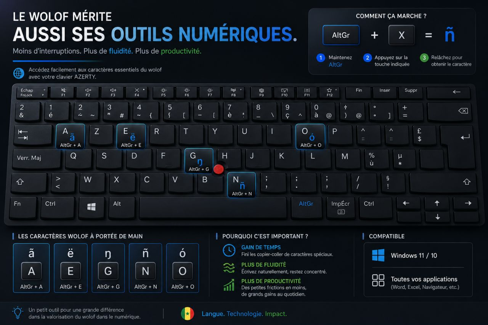

# Wolof Keyboard

## About

Wolof Keyboard is a Windows keyboard layout designed to facilitate writing Wolof on digital devices.

The project was created to make standard Wolof orthography more accessible and to support the growing use of national languages in digital and professional environments.

As local languages increasingly enter education, media, public communication and digital platforms, appropriate writing tools become essential.

## Why this project?

Writing a language should not be a technical obstacle.

This keyboard aims to make Wolof easier to write while respecting its orthographic system and promoting its use in everyday digital communication.

## Features

* Quick access to Wolof-specific characters
* Improved typing experience
* Support for standard Wolof orthography
* Easy integration into digital workflows

## Characters supported

The keyboard facilitates access to:

À É Ë Ñ Ó Ŋ

and other characters commonly used in standard Wolof orthography.

## Wolof Keyboard Layout

## Current Status

This keyboard is currently functional and available for installation on Windows.

The project was initially developed for personal use and is now documented to facilitate testing, feedback and future improvements.

## Download

Download the latest version from the **Releases** page.

👉 https://github.com/samuelbenga/wolof-keyboard/releases/latest

After downloading:

1. Extract the ZIP archive.
2. Run **setup.exe**.
3. Follow the installation wizard.

## Installation (Windows)

1. Download the latest release.
2. Extract the ZIP archive.
3. Run **setup.exe**.
4. Complete the installation.
5. Open:

   **Settings → Time & Language → Language & Region → Keyboard**

6. Add the **Wolof Keyboard** layout.
7. Start typing in Wolof.

For detailed instructions, see:

[Installation Guide](docs/installation-guide.md)

## Roadmap

- [x] Keyboard layout design
- [x] Personal testing
- [x] Windows installation package
- [x] GitHub documentation
- [x] User guide
- [ ] External testing
- [ ] Community feedback
- [ ] Future improvements

## Contributing

Contributions are welcome.

You can help by:

- reporting bugs;
- suggesting improvements;
- improving the documentation;
- contributing code;
- testing new releases.

Please open an issue or submit a pull request.

## Motivation

Digital inclusion requires more than content.

It also requires practical tools that enable people to write their languages easily and correctly.

This project is a contribution to strengthening Wolof's presence in digital environments and supporting the broader ecosystem of African language technologies.

## Author

*Wolof Language Specialist*  
*Localization Specialist*  
*Language Technology Advocate*  
*Open Source Contributor*

Communication • Languages • Impact

### Contact

- LinkedIn: https://www.linkedin.com/in/samuel-benga
- Email: samuelbenga92@gmail.com

## License

This project is licensed under the **MIT License**.

See the **LICENSE** file for details.
